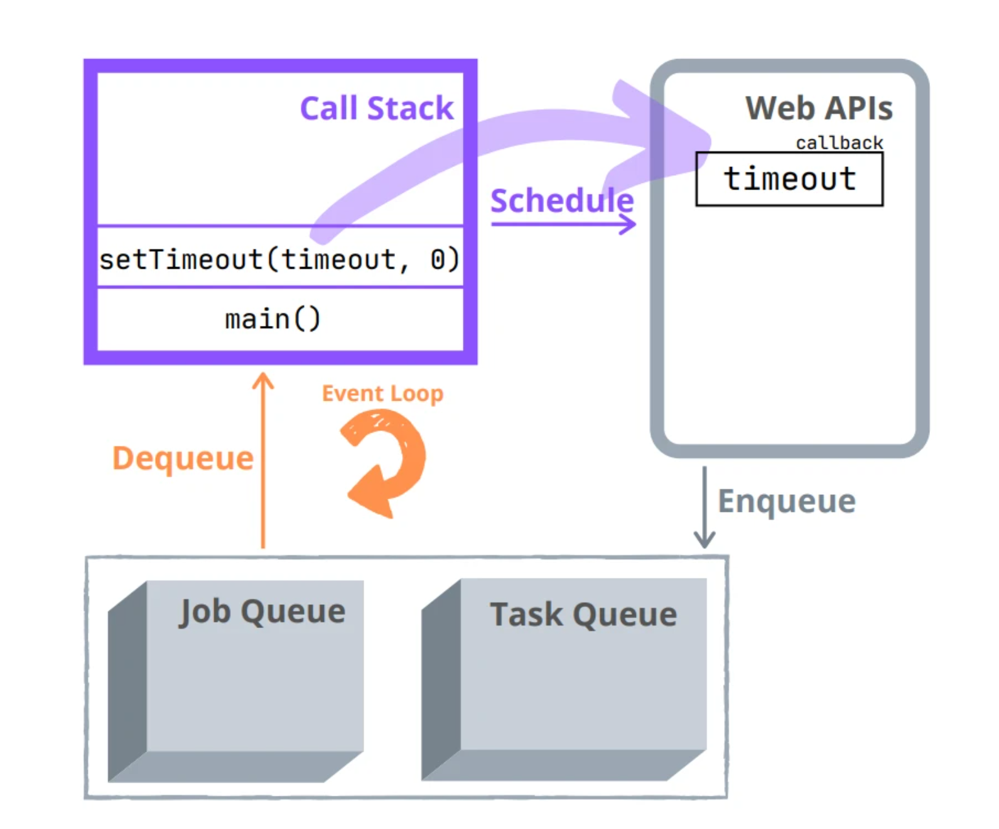
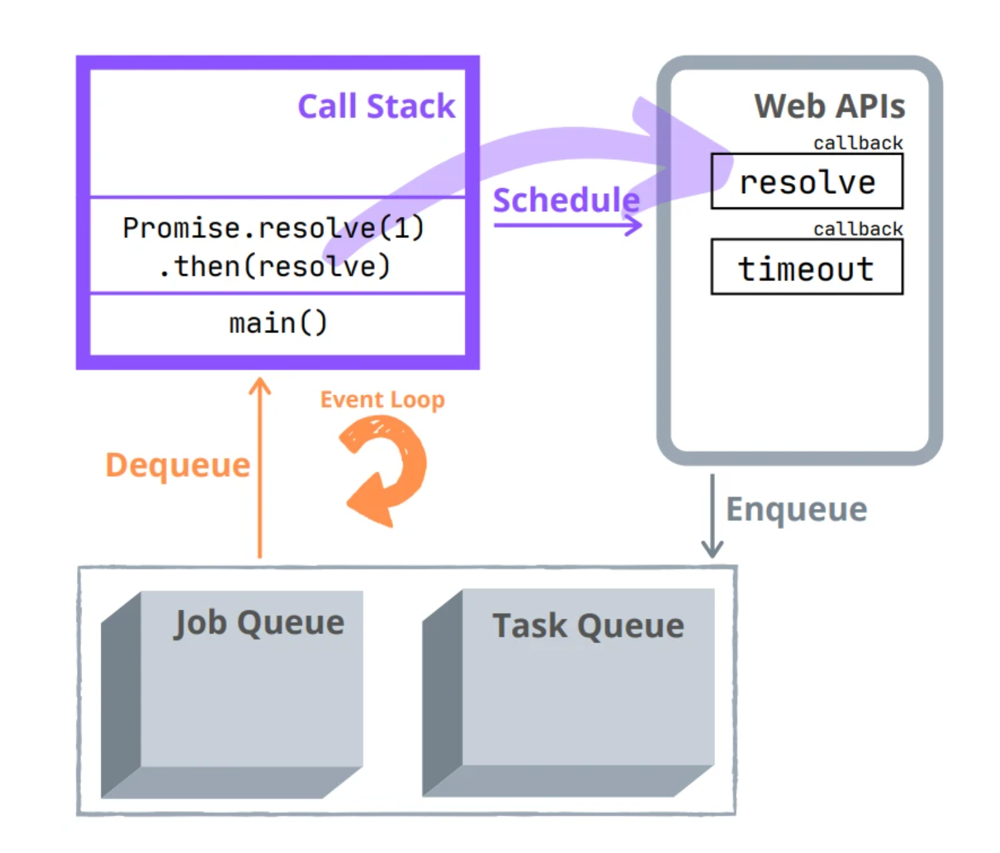
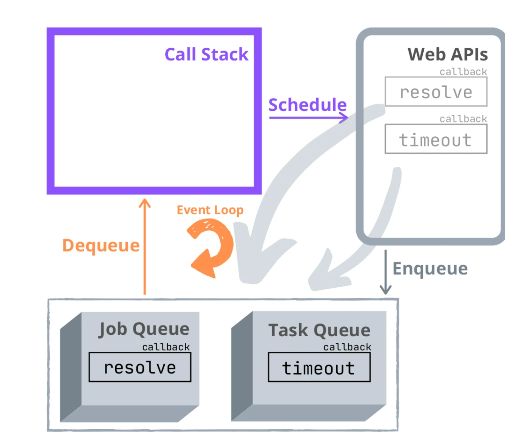
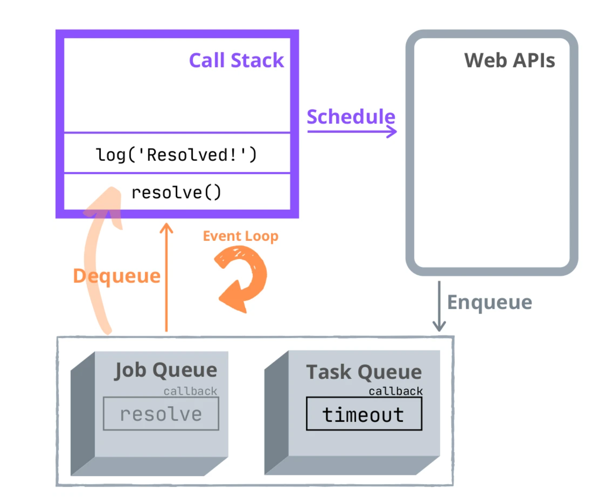
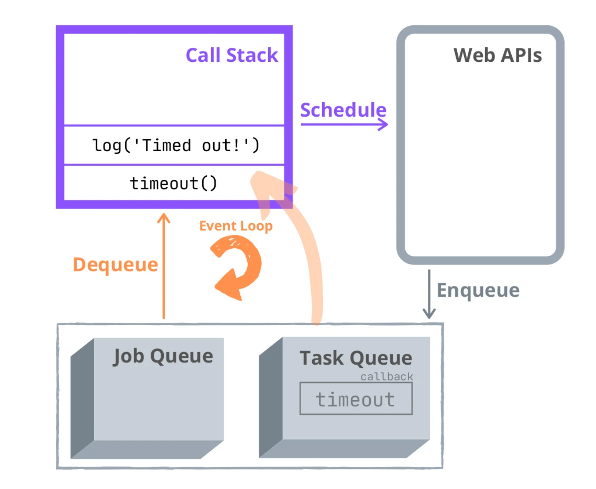

# Event Loop <!-- omit in toc -->

[Home](../README.md)

Ref:  
[JS info: Event loop](https://javascript.info/event-loop)  
[Why Promises Are Faster Than setTimeout()?](https://dmitripavlutin.com/javascript-promises-settimeout/)  
[What the heck is the event loop anyway?](https://www.youtube.com/watch?v=8aGhZQkoFbQ)  

<!-- omit in toc -->
## Topics 
- [Intro](#intro)
- [Example](#example)

## Intro
[Home](../README.md) | [Jump to Top](#topics)

- all asynchronous callbacks/tasks are executed after the script execution completes
- Asynchronous callbacks:
  - setTimeout and similar
  - UI Rendering
  - Promise resolve and reject callbacks
- **macrotasks**: setTimeout, setInterval, setImmediate, requestAnimationFrame, I/O, UI rendering
- **microtasks**: process.nextTick, Promises, queueMicrotask, MutationObserver
- Immediately after every macrotask, the engine executes all tasks from microtask queue, prior to running any other macrotasks or rendering or anything else.

## Example
[Home](../README.md) | [Jump to Top](#topics)

```js
setTimeout(function timeout() {
  console.log('Timed out!');
}, 0);

Promise.resolve(1).then(function resolve() {
  console.log('Resolved!');
});

alert("code");

/*
Output:
code
Resolved!
Timed out!
*/
```

**Why is Promise logged first?**






