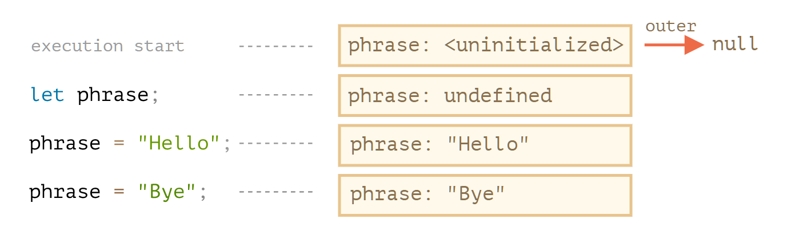
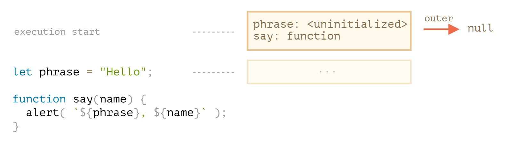

# Functions <!-- omit in toc -->
[Home](../README.md)

- [Basics](#basics)
- [Arrow functions](#arrow-functions)
- [Rest params and spread syntex](#rest-params-and-spread-syntex)
  - [rest `...`](#rest-)
  - [`arguments` variable](#arguments-variable)
  - [Spread syntax:](#spread-syntax)
- [Variable scope](#variable-scope)
- [Closure](#closure)
  - [Lexical Environment](#lexical-environment)
  - [Examples - Closure](#examples---closure)
- [Function object, NFE](#function-object-nfe)
- [Scheduling: setTimeout and setInterval](#scheduling-settimeout-and-setinterval)
  - [setTimeout](#settimeout)
  - [setInterval](#setinterval)
  - [Nested setTimeout vs setInterval](#nested-settimeout-vs-setinterval)
  - [Zero delay setTimeout](#zero-delay-settimeout)
- [Decorators and forwarding, call/apply](#decorators-and-forwarding-callapply)
  - [func.call](#funccall)
- [Debounce](#debounce)
- [Throttle](#throttle)
  - [bind](#bind)
  - [Partial function](#partial-function)
  - [Examples - Bind](#examples---bind)
  
## Basics
- Function `Declarations`:
  ```js
  function sum(a, b) {
    let result = a + b;
    return result;
  }
  ```
- Function `Expression`:

  ```js
  let sum = function (a, b) {
    let result = a + b;
    return result;
  };
  ```

- `Callback` and `Anonymous`: Both are Function Expressions

  ```js
  function ask(question, yes, no) {
    // yes and no are callbacks
    if (confirm(question)) yes();
    else no();
  }

  ask(
    "Do you agree?",
    function () {
      alert("You agreed.");
    }, // Anonymous
    function () {
      alert("You canceled the execution.");
    }
  );
  ```
- `new Function()`
  ```js
  let sum = new Function('a', 'b', 'return a + b');
  
  alert( sum(1, 2) ); // 3
  ```

- `a function always gets a copy of the value`
- We declare functions listing their `parameters`, then call them passing `arguments`.
- If a function is called, but an argument is not provided, then the corresponding value becomes `undefined`
- function is always copied by value, not reference like an object
- `default value`, complex example:
  ```js
  function showMessage(from, text = anotherFunction()) {
    // anotherFunction() only executed if no text given
    // its result becomes the value of text
  }
  ```
  it’s independently called every time when text is missing.
  ```js
  function showCount(count) {
    // if count is undefined or null, show "unknown"
    alert(count ?? "unknown");
  }
  ```
- `A function with an empty return or without it returns undefined`
- a function is a `value`
- Function Expression vs Declaration:
  - A Function Expression is created when the execution reaches it and is usable only from that moment.

| Function Expression               | Function Declaration                        |
| --------------------------------- | ------------------------------------------- |
| created when execution reaches it | processed before the code block is executed |
| usable only creation              | can be called earlier than defined          |

## Arrow functions

- usually required when we dont want to use the `this` of the function, but want to use from the outer function/environment/context
- they don't have their own this. If we reference `this` from such a function, it's taken from the outer 'normal' function.
- Cant be used as a constructor
- dont have `arguments` object, takes from outer
- ```js
  // expression at the right side
  let sum = (a, b) => a + b;

  // or multi-line syntax with { ... }, need return here:
  let sum = (a, b) => {
    // ...
    return a + b;
  };

  // without arguments
  let sayHi = () => alert("Hello");

  // with a single argument
  let double = (n) => n * 2; // no need of bracked around n

  // ----------- returning an object, check extra bracket--------
  let usersMapped = users.map(user => ({
    fullName: `${user.name} ${user.surname}`,
    id: user.id
  }));
  ```

- `Callback` using arrow functions:

  ```js
  let ask = (question, yes, no) => {
    // yes and no are callbacks
    if (confirm(question)) yes();
    else no();
  };

  ask(
    "Do you agree?",
    () => alert("You agreed."), // Anonymous
    () => alert("You canceled the execution.")
  );
  ```

## Rest params and spread syntex

### rest `...`
  ```js
  // ------- this is valid ------------
  function sum(a, b) {
    return a + b;
  }
  
  alert( sum(1, 2, 3, 4, 5) );
  ```
  - should be at the end only
  - all remaining args go into rest params
  
  ```js
  function showName(firstName, lastName, ...titles) {
    alert( firstName + ' ' + lastName ); // Julius Caesar
  
    // the rest go into titles array
    // i.e. titles = ["Consul", "Imperator"]
    alert( titles[0] ); // Consul
    alert( titles[1] ); // Imperator
    alert( titles.length ); // 2
  }
  
  showName("Julius", "Caesar", "Consul", "Imperator");
  ```
### `arguments` variable
  ```js
  function showName() {
    alert( arguments.length );
    alert( arguments[0] );
    alert( arguments[1] );
  
    // it's iterable
    // for(let arg of arguments) alert(arg);
  }
  
  // shows: 2, Julius, Caesar
  showName("Julius", "Caesar");
  
  // shows: 1, Ilya, undefined (no second argument)
  showName("Ilya");
  ```
### Spread syntax:
  - expand array or iterable to variables
     ```js
    let arr1 = [1, -2, 3, 4];
    let arr2 = [8, 3, -8, 1];
    
    alert( Math.max(1, ...arr1, 2, ...arr2, 25) ); // 25
    ```
  - merge arrays:
    ```js
    let arr = [3, 5, 1];
    let arr2 = [8, 9, 15];
    
    let merged = [0, ...arr, 2, ...arr2];
    
    alert(merged); // 0,3,5,1,2,8,9,15 (0, then arr, then 2, then arr2)
    ```
  - converting any iterable to array:
    ```js
    let str = "Hello";
      
    alert( [...str] ); // H,e,l,l,o
    ```
When we see "..." in the code, it is either rest parameters or the spread syntax.

There’s an easy way to distinguish between them:

When ... is at the end of function parameters, it’s “rest parameters” and gathers the rest of the list of arguments into an array.
When ... occurs in a function call or alike, it’s called a “spread syntax” and expands an array into a list.
Use patterns:

Rest parameters are used to create functions that accept any number of arguments.
The spread syntax is used to pass an array to functions that normally require a list of many arguments.

## Variable scope

- Code blocks: If a variable is declared inside a code block {...}, it’s only visible inside that block.
  ```js
  {
    // show message
    let message = "Hello";
    alert(message);
  }
  
  {
    // show another message
    let message = "Goodbye";
    alert(message);
  }
  ```
- Nested Functions:  
  - a nested function can be returned:
    - as a property of a new object
    - as a result by itself.
  - It can then be used somewhere else. No matter where, it **still has access to the same outer variables**.
    ```js
    function makeCounter() {
      let count = 0;
    
      return function() {
        return count++;
      };
    }
    
    let counter = makeCounter();
    
    alert( counter() ); // 0
    alert( counter() ); // 1
    alert( counter() ); // 2
    ```

## Closure

internals: https://javascript.info/closure#lexical-environment

### Lexical Environment

- Variables:   
  
  

- Function Declarations:
  - are instantly fully initialized, only declaration
  

- Inner and outer Lexical Environment
    
### Examples - Closure

https://javascript.info/closure#tasks

## Function object, NFE

- Functions are object
- Function properties:
  - name
  - length: number of params, ignore ...rest
  - custom props
- NFE: Named Function Expression
  - Useful for reliable self calls
  ```js
  let sayHi = function func(who) {
    if (who) {
      alert(`Hello, ${who}`);
    } else {
      func("Guest"); // Now all fine
    }
  };
  
  let welcome = sayHi;
  sayHi = null;
  
  welcome(); // Hello, Guest (nested call works)
  ```

```js
function sum(a) {

  let currentSum = a;

  function f(b) {
    currentSum += b;
    return f;
  }

  f.toString = function() {
    return currentSum;
  };

  return f;
}

alert( sum(1)(2) ); // 3
alert( sum(5)(-1)(2) ); // 6
alert( sum(6)(-1)(-2)(-3) ); // 0
alert( sum(0)(1)(2)(3)(4)(5) ); // 15
```

## Scheduling: setTimeout and setInterval

- **Always clear the setInterval/setTimeout functions** because of their memory usage.
- not guarrenteed but minimum  time of execution
- always runs at the end of the script

### setTimeout
- syntax:
  ```js
  let timerId = setTimeout(func|code, [delay], [arg1], [arg2], ...)
  ```
- default delay is 0.
  ```js
  function sayHi(phrase, who) {
    alert( phrase + ', ' + who );
  }
  
  setTimeout(sayHi, 1000, "Hello", "John"); // Hello, John

  setTimeout("alert('Hello')", 1000);

  setTimeout(() => alert('Hello'), 1000);
  ```
- pass the function, `DON'T RUN IT`
- `clearTimeout(timerId)`
  ```js
  let timerId = setTimeout(() => alert("never happens"), 1000);
  alert(timerId); // timer identifier
  
  clearTimeout(timerId);
  alert(timerId); // same identifier (doesn't become null after canceling)
  ```

- error handling:
  ```js
  // ------------- wrong -------------
  try {
    setTimeout(function() {
      noSuchVariable; // script will die here
    }, 1000);
  } catch (err) {
    alert( "won't work" );
  }
  
  // -------------- correct ------------
  setTimeout(function() {
    try {
      noSuchVariable; // try...catch handles the error!
    } catch {
      alert( "error is caught here!" );
    }
  }, 1000);
  ```
### setInterval

- Syntax:
  ```js
  let timerId = setInterval(func|code, [delay], [arg1], [arg2], ...)
  ```
- regularly after the delay
  ```js
  // repeat with the interval of 2 seconds
  let timerId = setInterval(() => alert('tick'), 2000);

  // after 5 seconds stop
  setTimeout(() => { clearInterval(timerId); alert('stop'); }, 5000);
  ```
- `Time goes on while alert is shown`
  - by the time we dismiss alert, next alert may come. The actual time between alerts wont be the given interval

### Nested setTimeout vs setInterval

-
  ```js
  let timerId = setTimeout(function tick() {
    alert('tick');
    timerId = setTimeout(tick, 2000); // (*)
  }, 2000);
  ```

- **Nested setTimeout allows to set the delay between the executions more precisely than setInterval.**
- **The real delay between func calls for setInterval is less than in the code!** because the time taken by func's execution “consumes” a part of the interval.
- The nested setTimeout guarantees the fixed delay because a new call is planned at the end of the previous one.

### Zero delay setTimeout

- Zero delay scheduling with `setTimeout(func, 0)` (the same as `setTimeout(func)`) is used to schedule the call “as soon as possible, but after the current script is complete”.
- The browser limits the minimal delay for five or more nested calls of setTimeout or for setInterval (after 5th call) to 4ms. That’s for historical reasons.

## Decorators and forwarding, call/apply

### func.call

- Syntax:
  ```js
  func.call(context, arg1, arg2, ...)
  ```
- Example:
  ```js
  function say(phrase) {
    alert(this.name + ': ' + phrase);
  }
  
  let user = { name: "John" };
  let admin = { name: "Admin" };
  
  // user becomes this, and "Hello" becomes the first argument
  say.call( user, "Hello" ); // John: Hello
  say.call( admin, "Hello" ); // Admin: Hello
  ```
- for multiple unknown count of arguments:
  ```js
  func.call(this, ...arguments)
  ```

Decorator is a wrapper around a function that alters its behavior. The main job is still carried out by the function.

Decorators can be seen as “features” or “aspects” that can be added to a function. We can add one or add many. And all this without changing its code!

To implement cachingDecorator, we studied methods:
- `func.call(context, arg1, arg2…)` – calls func with given context and arguments.
- `func.apply(context, args)` – calls func passing context as this and array-like args into a list of arguments.

The generic *call forwarding* is usually done with `apply`:

```js
let wrapper = function() {
  return original.apply(this, arguments);
};
```

- Method borrowing:
  ```js
  function hash() {
    alert( arguments.join() ); // Error: arguments.join is not a function
  }
  
  hash(1, 2);
  ```
  ```js
  function hash() {
    alert( [].join.call(arguments) ); // 1,2
  }
  
  hash(1, 2);
  ```

- Examples:
  - https://javascript.info/call-apply-decorators#spy-decorator
  - https://javascript.info/call-apply-decorators#delaying-decorator

## Debounce

- The result of `debounce(f, ms)` decorator is a wrapper that suspends calls to f until there’s ms milliseconds of inactivity (no calls, “cooldown period”), then invokes f once with the latest arguments.
- And it will get the arguments of the very last call, other calls are ignored.
- It waits the given time after the last call, and then runs its function, that can process the result.
```js
function debounce(func, ms) {
	let timerId = null;
	function f() {
  	clearTimeout(timerId);
    timerId = setTimeout(func, ms, ...arguments);
    //timerId = setTimeout(() => func.apply(this, arguments), ms);
  }
  return f;
}

let f = debounce(console.log, 2000);

f("a");
setTimeout( () => f("b"), 200);
setTimeout( () => f("c"), 500);
```

## Throttle

- `throttle(f, ms)`
- The difference with debounce is that it’s completely different decorator:
  - debounce runs the function once after the “cooldown” period. Good for processing the final result.
  - throttle runs it not more often than given ms time. Good for regular updates that shouldn’t be very often.
- Example:
  ```js
  function f(a) {
    console.log(a);
  }
  
  // f1000 passes calls to f at maximum once per 1000 ms
  let f1000 = throttle(f, 1000);
  
  f1000(1); // shows 1
  f1000(2); // (throttling, 1000ms not out yet)
  f1000(3); // (throttling, 1000ms not out yet)
  
  // when 1000 ms time out...
  // ...outputs 3, intermediate value 2 was ignored
  ```
- ```js
  function throttle(func, ms) {
  
    let isThrottled = false,
      savedArgs,
      savedThis;
  
    function wrapper() {
  
      if (isThrottled) { // (2)
        savedArgs = arguments;
        savedThis = this;
        return;
      }
      isThrottled = true;
  
      func.apply(this, arguments); // (1)
  
      setTimeout(function() {
        isThrottled = false; // (3)
        if (savedArgs) {
          wrapper.apply(savedThis, savedArgs);
          savedArgs = savedThis = null;
        }
      }, ms);
    }
  
    return wrapper;
  }
  ```

## Bind

### Losing this

```js
let user = {
  firstName: "John",
  sayHi() {
    alert(`Hello, ${this.firstName}!`);
  }
};

setTimeout(user.sayHi, 1000); // Hello, undefined!
```

solution1: using wrapper:

```js
setTimeout(() => user.sayHi(), 1000); // Hello, John!
```
takes user from outer lexical environment. But user can change after setting the timeout and then it would fail.

### bind

Fixed `this`, even if it changes binding
```js
let user = {
  firstName: "John"
};

function func() {
  alert(this.firstName);
}

let funcUser = func.bind(user);
funcUser(); // John
```

- Object method:
  ```js
  let user = {
    firstName: "John",
    sayHi() {
      alert(`Hello, ${this.firstName}!`);
    }
  };
  
  let sayHi = user.sayHi.bind(user); // (*)
  
  // can run it without an object
  sayHi(); // Hello, John!
  
  setTimeout(sayHi, 1000); // Hello, John!
  
  // even if the value of user changes within 1 second
  // sayHi uses the pre-bound value which is reference to the old user object
  user = {
    sayHi() { alert("Another user in setTimeout!"); }
  };
  ```

### Partial function

- binding arguments as well
  ```js
  let bound = func.bind(context, [arg1], [arg2], ...);
  ```
  ```js
  function mul(a, b) {
    return a * b;
  }
  
  let double = mul.bind(null, 2);
  
  alert( double(3) ); // = mul(2, 3) = 6
  alert( double(4) ); // = mul(2, 4) = 8
  alert( double(5) ); // = mul(2, 5) = 10
  ```
- test
- 

### Examples - Bind

- example
  ```js
  function f() {
    alert( this ); // null
  }
  
  let user = {
    g: f.bind(null)
  };
  
  user.g();
  ```
- Rebound
  ```js
  function f() {
    alert(this.name);
  }
  
  f = f.bind( {name: "John"} ).bind( {name: "Ann" } );
  
  f(); // John
  ```
  **A function cannot be re-bound.**
- Function property after bind
  ```js
  function sayHi() {
    alert( this.name );
  }
  sayHi.test = 5;
  
  let bound = sayHi.bind({
    name: "John"
  });
  
  alert( bound.test ); // undefined
  ```
  **The result of bind is another object. It does not have the test property.**
- 

