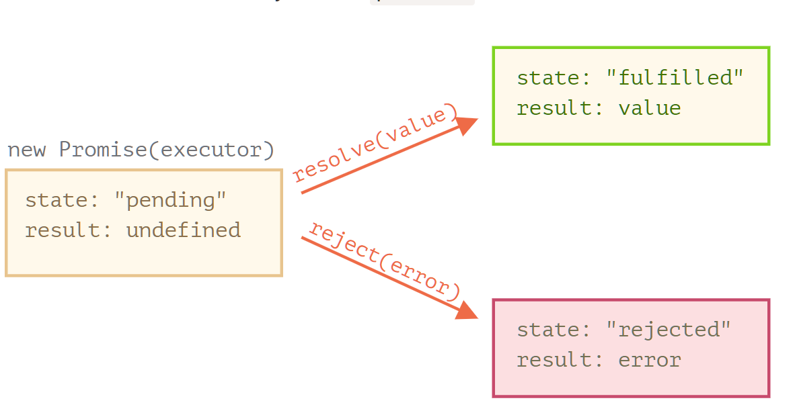

# Promises, async/await <!-- omit in toc -->

[Home](../README.md)

<!-- omit in toc -->
## Topics 
- [Callbacks](#callbacks)
- [Promise](#promise)
- [Promise Chaining](#promise-chaining)
- [Error/Exception Handling](#errorexception-handling)
- [Promise API](#promise-api)
  - [Promise.all](#promiseall)
  - [Others](#others)
  - [Promisify](#promisify)
- [Async/Await](#asyncawait)
  - [Error Handling](#error-handling)

## Callbacks
[Home](../README.md) | [Jump to Top](#topics)

- Example:
  ```js
  function loadScript(src, callback) {
    let script = document.createElement('script');
    script.src = src;
  
    script.onload = () => callback(null, script);
    script.onerror = () => callback(new Error(`Script load error for ${src}`));
  
    document.head.append(script);
  }
  
  loadScript('https://cdnjs.cloudflare.com/ajax/libs/lodash.js/3.2.0/lodash.js', (error, script) => {
    if (error) {
      alert("Error", error);
    }
    else {
      alert(`Cool, the script ${script.src} is loaded`);
      alert( _ ); // function declared in the loaded script
    }
  });
  ```
- A `callback` function is a function that is passed as an argument to another function, to be “called back” at a later time
- A function that does something asynchronously should provide a callback argument where we put the function to run after it’s complete.
- A function that accepts other functions as arguments is called a `higher-order function` , which contains the logic for when the callback function gets executed.
- Convention is to write `error first` callback functions
- `Pyramid of Doom` or `Callback Hell` because of nested callbacks for asynchronous calls
  - Solution: **Promise**

## Promise
[Home](../README.md) | [Jump to Top](#topics)

- **Promise `then` is always run at the end of the script, in sequence of `then`**

- Producer Syntax:
  ```js
  let promise = new Promise(function(resolve, reject) {
    // executor (the producing code, "singer")
    // once done, call resolve or reject
    resolve("done");
    // or reject(new Error("Whoops!")
  });
  ```
- Consumer Syntax:
  ```js
  output = promise
          .then(result => alert(result))
          .catch(error => alert(error.message))
          .finally(() => alert("cleanup irrespective of resolve or reject"));
  ```
  OR
  ```js
  promise
    .then(
      result => alert(result),
      error => alert(error.message)
    )
    .finally(() => alert("cleanup irrespective of resolve or reject"));
  ```
- Promise states:
  

- Above function using promise:
  ```js
  function loadScript(src) {
    return new Promise(function(resolve, reject) {
      let script = document.createElement('script');
      script.src = src;
  
      script.onload = () => resolve(script);
      script.onerror = () => reject(new Error(`Script load error for ${src}`));
  
      document.head.append(script);
    });
  }

  let promise = loadScript("https://cdnjs.cloudflare.com/ajax/libs/lodash.js/4.17.11/lodash.js");
  
  promise.then(
    script => alert(`${script.src} is loaded!`),
    error => alert(`Error: ${error.message}`)
  );
  
  promise.then(script => alert('Another handler...'));
  ```

|         Promises          |         Callbacks         |
| ------------------------- | ------------------------- |
| Promises allow us to do things in the natural order. First, we run loadScript(script), and .then we write what to do with the result. | We must have a callback function at our disposal when calling loadScript(script, callback). In other words, we must know what to do with the result before loadScript is called.|
| We can call .then on a Promise as many times as we want. | There can be only one callback |


## Promise Chaining
[Home](../README.md) | [Jump to Top](#topics)

- **Solution one** for callback hell
  ```js
  new Promise(function(resolve, reject) {
  
    setTimeout(() => resolve(1), 1000); // (*)
  
  }).then(function(result) { // (**)
  
    alert(result); // 1
    return result * 2;
  
  }).then(function(result) { // (***)
  
    alert(result); // 2
    return result * 2;
  
  }).then(function(result) {
  
    alert(result); // 4
    return result * 2;
  
  });
  ```
  Because `.then()` returns a promise object

- Explictly Returning promise from then:
  ```js
  new Promise(function(resolve, reject) {
  
    setTimeout(() => resolve(1), 1000);
  
  }).then(function(result) {
  
    alert(result); // 1
  
    return new Promise((resolve, reject) => { // (*)
      setTimeout(() => resolve(result * 2), 1000);
    });
  
  }).then(function(result) { // (**)
  
    alert(result); // 2
  
    return new Promise((resolve, reject) => {
      setTimeout(() => resolve(result * 2), 1000);
    });
  
  }).then(function(result) {
  
    alert(result); // 4
  
  });
  ```
- Examples:
  ```js
  loadScript("/article/promise-chaining/one.js")
    .then(script => loadScript("/article/promise-chaining/two.js"))
    .then(script => loadScript("/article/promise-chaining/three.js"))
    .then(script => {
      // scripts are loaded, we can use functions declared there
      one();
      two();
      three();
    });
  ```
  ```js
  // works but bad
  loadScript("/article/promise-chaining/one.js").then(script1 => {
    loadScript("/article/promise-chaining/two.js").then(script2 => {
      loadScript("/article/promise-chaining/three.js").then(script3 => {
        // this function has access to variables script1, script2 and script3
        one();
        two();
        three();
      });
    });
  });
  ```
  ```js
  fetch('/article/promise-chaining/user.json')
    .then(response => response.json())
    .then(user => fetch(`https://api.github.com/users/${user.name}`))
    .then(response => response.json())
    .then(githubUser => new Promise(function(resolve, reject) { // (*)
      let img = document.createElement('img');
      img.src = githubUser.avatar_url;
      img.className = "promise-avatar-example";
      document.body.append(img);
  
      setTimeout(() => {
        img.remove();
        resolve(githubUser); // (**)
      }, 3000);
    }))
    // triggers after 3 seconds
    .then(githubUser => alert(`Finished showing ${githubUser.name}`));
  ```
  ```js
  promise.then(f1).catch(f2); // 1
  // is not same as 
  promise.then(f1, f2); // 2
  // becuase in 1 it can catch the exception from f1 as well
  ```
## Error/Exception Handling
[Home](../README.md) | [Jump to Top](#topics)

- `.catch()` can handle both rejections and exception in then block
- position of catch matters
- ```js
    // the execution: catch -> catch
    new Promise((resolve, reject) => {
    
      throw new Error("Whoops!");
    
    }).catch(function(error) { // (*)
    
      if (error instanceof URIError) {
        // handle it
      } else {
        alert("Can't handle such error");
    
        throw error; // throwing this or another error jumps to the next catch
      }
    
    }).then(function() {
      /* doesn't run here */
    }).then(function() {
      /* doesn't run here */
    }).then(function() {
      /* doesn't run here */
    }).catch(error => { // (**)
    
      alert(`The unknown error has occurred: ${error}`);
      // don't return anything => execution goes the normal way
    });
    ```
- if catch is not there to accept the exception:
  ```js
  let promise = Promise.reject(new Error("Promise Failed!"));
  
  // Promise Failed!
  window.addEventListener('unhandledrejection', event => alert(event.reason));
  ```


## Promise API

### Promise.all
[Home](../README.md) | [Jump to Top](#topics)

- returns array of resolved values
- ```js
  Promise.all([
    new Promise(resolve => setTimeout(() => resolve(1), 3000)), // 1
    new Promise(resolve => setTimeout(() => resolve(2), 2000)), // 2
    new Promise(resolve => setTimeout(() => resolve(3), 1000))  // 3
  ]).then(alert); // 1,2,3 when promises are ready: each promise contributes an array member
    ```
- maintains order, irrespective of order of completion
- ```js
  let names = ['iliakan', 'remy', 'jeresig'];
  
  let requests = names.map(name => fetch(`https://api.github.com/users/${name}`));
  
  Promise.all(requests)
    .then(responses => {
      // all responses are resolved successfully
      for(let response of responses) {
        alert(`${response.url}: ${response.status}`); // shows 200 for every url
      }
  
      return responses;
    })
    // map array of responses into an array of response.json() to read their content
    .then(responses => Promise.all(responses.map(r => r.json())))
    // all JSON answers are parsed: "users" is the array of them
    .then(users => users.forEach(user => alert(user.name)));
    ```
- If any one fails, it immediately rejects, ignoring other successful resolves
  
### Others

- `Promise.allSettled(promises)` (recently added method) – waits for all promises to settle and returns their results as an array of objects with:
  - status: "fulfilled" or "rejected"
  - value (if fulfilled) or reason (if rejected).
    ```js
    let urls = [
      'https://api.github.com/users/iliakan',
      'https://api.github.com/users/remy',
      'https://no-such-url'
    ];
    
    Promise.allSettled(urls.map(url => fetch(url)))
      .then(results => { // (*)
        results.forEach((result, num) => {
          if (result.status == "fulfilled") {
            alert(`${urls[num]}: ${result.value.status}`);
          }
          if (result.status == "rejected") {
            alert(`${urls[num]}: ${result.reason}`);
          }
        });
      });
      /*
      [
        {status: 'fulfilled', value: ...response...},
        {status: 'fulfilled', value: ...response...},
        {status: 'rejected', reason: ...error object...}
      ]
      */
      ```
- `Promise.race(promises)` – waits for the first promise to settle, and its result/error becomes the outcome.
  ```js
  Promise.race([
    new Promise((resolve, reject) => setTimeout(() => resolve(1), 1000)),
    new Promise((resolve, reject) => setTimeout(() => reject(new Error("Whoops!")), 2000)),
    new Promise((resolve, reject) => setTimeout(() => resolve(3), 3000))
  ]).then(alert); // 1
  ```
- `Promise.any(promises)` (recently added method) – waits for the first promise to fulfill, and its result becomes the outcome. If all of the given promises are rejected, AggregateError becomes the error of Promise.any.
  ```js
  Promise.any([
    new Promise((resolve, reject) => setTimeout(() => reject(new Error("Whoops!")), 1000)),
    new Promise((resolve, reject) => setTimeout(() => resolve(1), 2000)),
    new Promise((resolve, reject) => setTimeout(() => resolve(3), 3000))
  ]).then(alert); // 1
  ```
  ```js
  Promise.any([
    new Promise((resolve, reject) => setTimeout(() => reject(new Error("Ouch!")), 1000)),
    new Promise((resolve, reject) => setTimeout(() => reject(new Error("Error!")), 2000))
  ]).catch(error => {
    console.log(error.constructor.name); // AggregateError
    console.log(error.errors[0]); // Error: Ouch!
    console.log(error.errors[1]); // Error: Error
  });
  ```
- `Promise.resolve(value)` – makes a resolved promise with the given value.
  ```js
  let cache = new Map();
  
  function loadCached(url) {
    if (cache.has(url)) {
      return Promise.resolve(cache.get(url)); // (*)
    }
  
    return fetch(url)
      .then(response => response.text())
      .then(text => {
        cache.set(url,text);
        return text;
      });
  }
  ```
- `Promise.reject(error)` – makes a rejected promise with the given error.

### Promisify

```js
'use strict';
alert = console.log

function getSum(a, b, callback) {
  if(typeof(a) != "number") {
    callback(new Error("Not number!"));
  }
  else {
    callback(null, a+b);
  }
}

getSum(1, 2, (error, result) => {
  if(error) {
    alert(error.message);
  }
  else {
    alert(result);
  }
})

function getSumPromise(a, b) {
  return new Promise((resolve, reject) => {
    getSum(a, b, function(error, result){
      if(error) {
        reject(error);
      }
      else {
        resolve(result);
      }
    })
  });
}


getSumPromise(1, 2)
  .then(result => alert(result))
  .catch(error => alert(error.message));

function promisify(f) {
  return function wrapper() {
    return new Promise((resolve, reject) => {
      f.call(this, ...arguments, function (error, result) {
        if (error) {
          reject(error);
        }
        else {
          resolve(result);
        }
      })
    })
  }
}

getSum = promisify(getSum);
getSum(1, 2)
.then(result => alert(result))
.catch(error => alert(error.message));

```

## Async/Await
[Home](../README.md) | [Jump to Top](#topics)

- **`async` functions always return a promise**, if the return is non promise, js converts them into promise
  ```js
  async function f() {
    return 1;
  }
  
  f().then(alert); // 1
  ```
  ```js
  async function f() {
    return Promise.resolve(1);
  }
  
  f().then(alert); // 1
  ```
- **`await` works only inside a async function and with a thenable object like promise**
- Theawait makes JavaScript wait until that promise settles and returns its result.
- await works as a alternative for `then`
- Update: await now works at top-level (without async function) in modules
  ```js
  async function f() {
  
    let promise = new Promise((resolve, reject) => {
      setTimeout(() => resolve("done!"), 1000)
    });
  
    let result = await promise; // wait until the promise resolves (*)
  
    alert(result); // "done!"
  }
  
  f();
  ```
  ```js
  class Waiter {
    async wait() {
      return await Promise.resolve(1);
    }
  }
  
  new Waiter()
    .wait()
    .then(alert); // 1 (this is the same as (result => alert(result)))
  ```
  ```js
  // ------------ works with Promise.all as well -------------
  let results = await Promise.all([
    fetch(url1),
    fetch(url2),
    ...
  ]);
  ```

### Error Handling

- if await promise fails or rejects, it throws exception
  ```js
  async function f() {
  
    try {
      let response = await fetch('/no-user-here');
      let user = await response.json();
    } catch(err) {
      // catches errors both in fetch and response.json
      alert(err);
    }
  }
  
  f();
  ```
- if we dont catch it at await:
  ```js
  async function f() {
    let response = await fetch('http://no-such-url');
  }
  
  // f() becomes a rejected promise
  f().catch(alert); // TypeError: failed to fetch // (*)
  ```
- worst case, `unhandledrejection` event handler
- 


